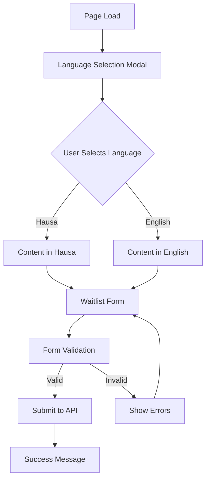

# Bilingual Waitlist Application - Product Requirements Document

## 1. Product Overview

A bilingual waitlist application that allows users to join a waiting list by providing their full name and WhatsApp number, with support for both Hausa and English languages.

The application solves the problem of collecting user interest and contact information in a culturally appropriate manner for Nigerian markets, specifically targeting both English and Hausa-speaking audiences. The product helps businesses build anticipation and gather qualified leads before product launch.

## 2. Core Features

### 2.1 User Roles

| Role | Registration Method | Core Permissions |
|------|---------------------|------------------|
| Visitor | Direct page access | Can select language, view content, submit waitlist form |

### 2.2 Feature Module

Our waitlist application consists of the following main pages:

1. **Waitlist Landing Page**: Language selection modal, hero section, waitlist form, success confirmation.

### 2.3 Page Details

| Page Name | Module Name | Feature description |
|-----------|-------------|---------------------|
| Waitlist Landing Page | Language Selection Modal | Display modal on page load with Hausa/English options, store preference, close modal after selection |
| Waitlist Landing Page | Hero Section | Display compelling headline, description, and call-to-action in selected language |
| Waitlist Landing Page | Waitlist Form | Collect full name and WhatsApp number with validation, submit to Laravel API |
| Waitlist Landing Page | Success Confirmation | Show thank you message in selected language after successful form submission |

## 3. Core Process

**User Flow:**
1. User visits the waitlist page
2. Language selection modal appears automatically
3. User selects preferred language (Hausa or English)
4. Page content updates to reflect selected language
5. User fills out the waitlist form (full name and WhatsApp number)
6. Form is validated and submitted to Laravel backend
7. Success message is displayed in the selected language

## 4. User Interface Design

### 4.1 Design Style

- **Primary Colors**: Blue (#3B82F6), Green (#10B981)
- **Secondary Colors**: Gray (#6B7280), White (#FFFFFF)
- **Button Style**: Rounded corners (8px), solid background with hover effects
- **Font**: Inter or system fonts, 16px base size, 18px for headings
- **Layout Style**: Clean, centered layout with card-based form design
- **Icons**: Feather icons or Heroicons for language selection and form elements

### 4.2 Page Design Overview

| Page Name | Module Name | UI Elements |
|-----------|-------------|-------------|
| Waitlist Landing Page | Language Selection Modal | Centered modal with flag icons, large buttons for each language, backdrop overlay |
| Waitlist Landing Page | Hero Section | Large heading, subtitle, background gradient, centered text alignment |
| Waitlist Landing Page | Waitlist Form | Two-column form on desktop, single column on mobile, floating labels, primary button |
| Waitlist Landing Page | Success Confirmation | Green checkmark icon, success message, option to share or close |

### 4.3 Responsiveness

Mobile-first responsive design with touch-optimized interactions. The application adapts seamlessly from mobile (320px) to desktop (1200px+) with appropriate spacing and component sizing.
