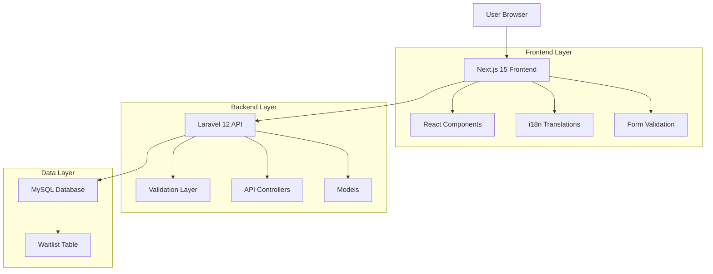
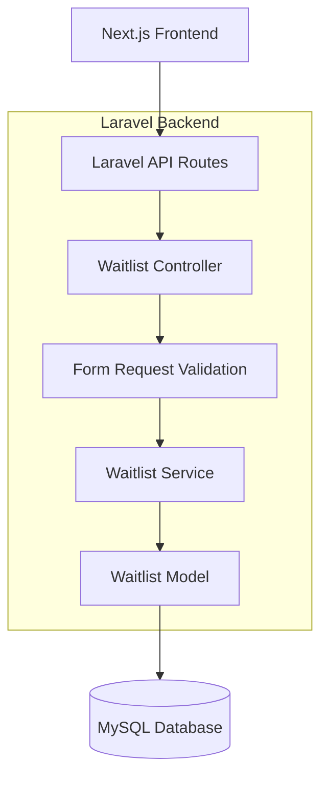
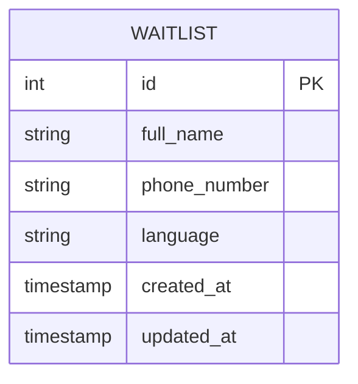

# Bilingual Waitlist Application - Technical Architecture Document

## 1. Architecture Design



## 2. Technology Description

* Frontend: Next.js 15 + React 18 + Tailwind CSS 4 + next-i18next

* Backend: Laravel 12 + PHP 8.2

* Database: MySQL 8.0

* Validation: Laravel Validation + Zod (Frontend)

## 3. Route Definitions

| Route         | Purpose                                                |
| ------------- | ------------------------------------------------------ |
| /             | Waitlist landing page with language selection and form |
| /api/waitlist | API endpoint for form submission (handled by Laravel)  |

## 4. API Definitions

### 4.1 Core API

Waitlist submission endpoint

```
POST /api/waitlist
```

Request:

| Param Name    | Param Type | isRequired | Description                             |
| ------------- | ---------- | ---------- | --------------------------------------- |
| full\_name    | string     | true       | User's full name (2-100 characters)     |
| phone\_number | string     | true       | WhatsApp phone number with country code |
| language      | string     | true       | Selected language preference (en/ha)    |

Response:

| Param Name | Param Type | Description                 |
| ---------- | ---------- | --------------------------- |
| success    | boolean    | Request success status      |
| message    | string     | Success or error message    |
| data       | object     | Submitted data (on success) |

Example Request:

```json
{
  "full_name": "Ahmad Musa",
  "phone_number": "+2348123456789",
  "language": "ha"
}
```

Example Response:

```json
{
  "success": true,
  "message": "Successfully added to waitlist",
  "data": {
    "id": 1,
    "full_name": "Ahmad Musa",
    "phone_number": "+2348123456789",
    "language": "ha",
    "created_at": "2024-01-15T10:30:00Z"
  }
}
```

## 5. Server Architecture Diagram



## 6. Data Model

### 6.1 Data Model Definition



### 6.2 Data Definition Language

Waitlist Table (waitlist\_entries)

```sql
-- Create waitlist entries table
CREATE TABLE waitlist_entries (
    id BIGINT UNSIGNED AUTO_INCREMENT PRIMARY KEY,
    full_name VARCHAR(100) NOT NULL,
    phone_number VARCHAR(20) NOT NULL,
    language ENUM('en', 'ha') NOT NULL DEFAULT 'en',
    created_at TIMESTAMP DEFAULT CURRENT_TIMESTAMP,
    updated_at TIMESTAMP DEFAULT CURRENT_TIMESTAMP ON UPDATE CURRENT_TIMESTAMP,
    
    INDEX idx_waitlist_language (language),
    INDEX idx_waitlist_created_at (created_at DESC),
    UNIQUE KEY unique_phone (phone_number)
);
```

## 7. Frontend Component Structure

### 7.1 Next.js 15 Components

```
src/
├── components/
│   ├── LanguageModal.tsx
│   ├── WaitlistForm.tsx
│   ├── HeroSection.tsx
│   └── SuccessMessage.tsx
├── pages/
│   ├── index.tsx
│   └── api/ (proxy to Laravel if needed)
├── hooks/
│   ├── useLanguage.ts
│   └── useWaitlist.ts
├── lib/
│   ├── api.ts
│   └── validation.ts
├── locales/
│   ├── en.json
│   └── ha.json
└── styles/
    └── globals.css
```

### 7.2 Laravel 12 Structure

```
app/
├── Http/
│   ├── Controllers/
│   │   └── WaitlistController.php
│   ├── Requests/
│   │   └── WaitlistRequest.php
│   └── Middleware/
│       └── Cors.php
├── Models/
│   └── WaitlistEntry.php
├── Services/
│   └── WaitlistService.php
database/
├── migrations/
│   └── create_waitlist_entries_table.php
routes/
└── api.php
```

## 8. Internationalization Strategy

### 8.1 Frontend i18n

* Use next-i18next for Next.js internationalization

* Store translations in JSON files (en.json, ha.json)

* Implement language detection and persistence in localStorage

* Support RTL layout if needed for Hausa

### 8.2 Backend Localization

* Laravel localization for API response messages

* Store language preference with each waitlist entry

* Validate language parameter in API requests

## 9. Validation Requirements

### 9.1 Frontend Validation (Zod)

```typescript
const waitlistSchema = z.object({
  full_name: z.string().min(2).max(100),
  phone_number: z.string().regex(/^\+[1-9]\d{1,14}$/),
  language: z.enum(['en', 'ha'])
});
```

### 9.2 Backend Validation (Laravel)

```php
public function rules(): array
{
    return [
        'full_name' => 'required|string|min:2|max:100',
        'phone_number' => 'required|string|regex:/^\+[1-9]\d{1,14}$/|unique:waitlist_entries',
        'language' => 'required|in:en,ha'
    ];
}
```

## 10. Deployment Considerations

### 10.1 Frontend Deployment

* Deploy Next.js 15 application to Vercel or Netlify

* Configure environment variables for API endpoints

* Enable static generation for optimal performance

### 10.2 Backend Deployment

* Deploy Laravel 12 API to shared hosting or VPS

* Configure CORS for frontend domain

* Set up MySQL database with proper indexing

* Configure environment variables for database and app settings

### 10.3 Integration

* Use absolute URLs for API calls from frontend

* Implement proper error handling and loading states

* Add rate limiting to prevent spam submissions

* Configure SSL certificates for both frontend and backend

