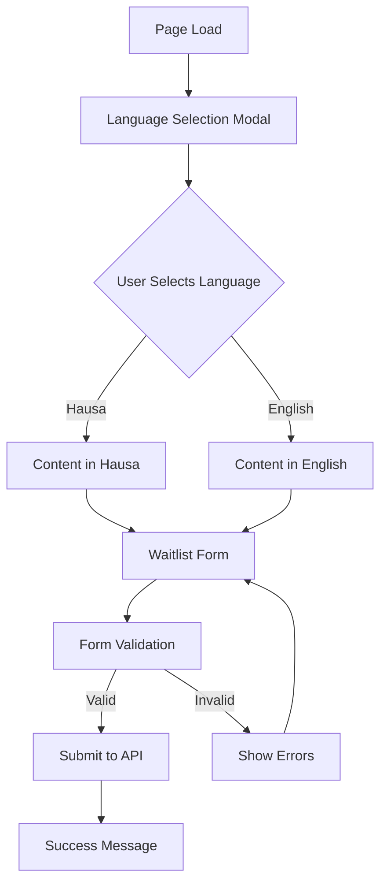
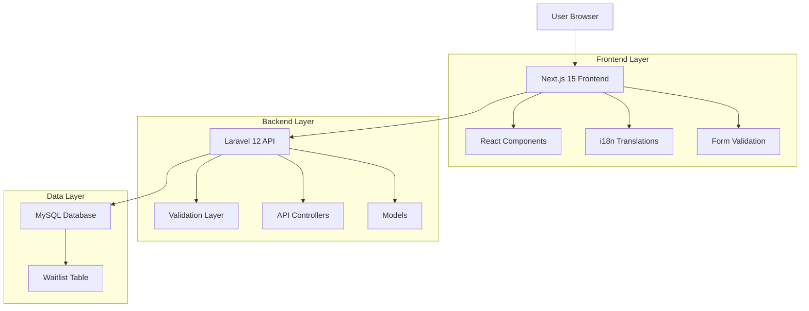
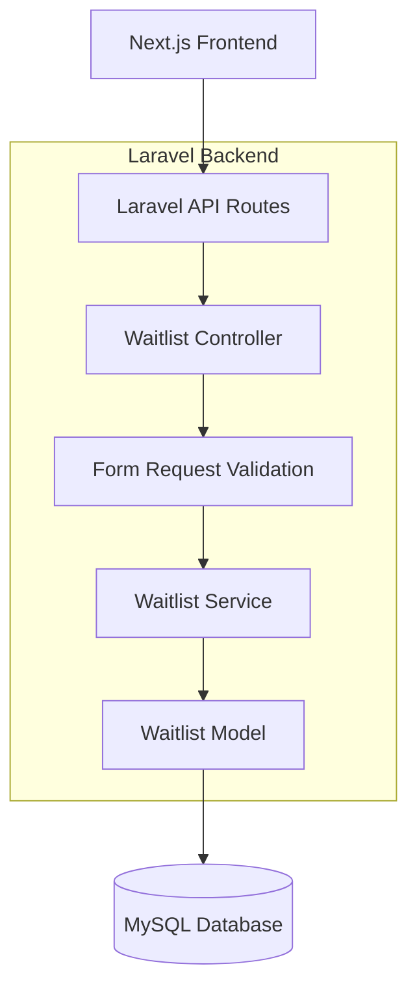
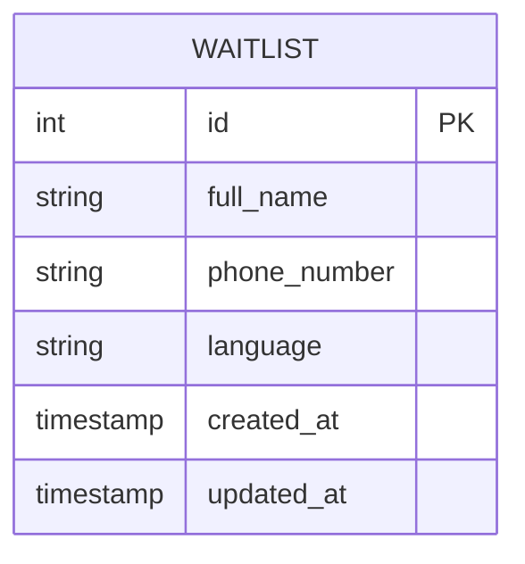

# Kasuabuy Waitlist - Bilingual Waitlist Application

A modern, bilingual waitlist application built with Laravel 12 and Next.js 15, featuring automatic language detection and Nigerian phone number validation. This application solves the problem of collecting user interest and contact information in a culturally appropriate manner for Nigerian markets, specifically targeting both English and Hausa-speaking audiences.

## 📋 Table of Contents

- [Features](#-features)
- [Technology Stack](#-technology-stack)
- [Product Requirements](#-product-requirements)
- [Technical Architecture](#-technical-architecture)
- [Prerequisites](#-prerequisites)
- [Installation](#-installation)
- [Usage](#-usage)
- [Project Structure](#-project-structure)
- [Internationalization](#-internationalization)
- [Testing](#-testing)
- [Deployment](#-deployment)
- [Contributing](#-contributing)
- [License](#-license)
- [Contact](#-contact)

## 🌟 Features

- **🌍 Bilingual Support**: Complete English and Hausa language support
- **🎯 Language Selection Modal**: Automatic popup on page load for language preference
- **📱 Nigerian Phone Validation**: Smart validation for all Nigerian phone number formats
- **✅ Form Validation**: Real-time validation with user-friendly error messages
- **📱 Responsive Design**: Mobile-first design that works on all devices
- **🎨 Modern UI**: Clean, professional interface with Tailwind CSS
- **⚡ Real-time Updates**: Instant language switching and form feedback
- **🔒 Data Validation**: Comprehensive frontend and backend validation
- **📊 Lead Collection**: Efficient system for gathering qualified leads before product launch
- **🎬 Advanced Animations**: Framer Motion powered animations with parallax effects
- **⌨️ Typewriter Effects**: Dynamic text animations for engaging user experience
- **🧭 Floating Navigation**: Smooth floating navigation with scroll-based visibility
- **🎯 Scroll Animations**: Scroll-triggered reveal animations and parallax backgrounds
- **🎨 Interactive Elements**: Hover effects and micro-interactions throughout the interface
- **📱 Touch Optimized**: Enhanced mobile interactions with gesture support

## 🛠 Technology Stack

### Backend
- **Laravel 12** - PHP framework
- **PHP 8.2+** - Server-side language
- **MySQL** - Database
- **Composer** - Dependency management

### Frontend
- **Next.js 15** - React framework with Turbopack
- **React 19** - UI library
- **TypeScript** - Type safety
- **Tailwind CSS 4** - Utility-first styling
- **Framer Motion** - Advanced animations and interactions
- **next-i18next** - Internationalization
- **Zod** - Form validation
- **Lucide React** - Modern icon library
- **Class Variance Authority** - Component styling utilities

## 📋 Product Requirements

### Product Overview

The bilingual waitlist application allows users to join a waiting list by providing their full name and WhatsApp number, with support for both Hausa and English languages. The product helps businesses build anticipation and gather qualified leads before product launch.

### User Roles

| Role | Registration Method | Core Permissions |
|------|---------------------|------------------|
| Visitor | Direct page access | Can select language, view content, submit waitlist form |

### Feature Modules

Our waitlist application consists of the following main components:

1. **Waitlist Landing Page**: Language selection modal, hero section, waitlist form, success confirmation.

### Page Details

| Page Name | Module Name | Feature Description |
|-----------|-------------|---------------------|
| Waitlist Landing Page | Language Selection Modal | Display modal on page load with Hausa/English options, store preference, close modal after selection |
| Waitlist Landing Page | Hero Section | Display compelling headline, description, and call-to-action in selected language |
| Waitlist Landing Page | Waitlist Form | Collect full name and WhatsApp number with validation, submit to Laravel API |
| Waitlist Landing Page | Success Confirmation | Show thank you message in selected language after successful form submission |

### User Flow

**Complete User Journey:**
1. User visits the waitlist page
2. Language selection modal appears automatically
3. User selects preferred language (Hausa or English)
4. Page content updates to reflect selected language
5. User fills out the waitlist form (full name and WhatsApp number)
6. Form is validated and submitted to Laravel backend
7. Success message is displayed in the selected language



### UI Design Guidelines

#### Design Style
- **Primary Colors**: Blue (#3B82F6), Green (#10B981)
- **Secondary Colors**: Gray (#6B7280), White (#FFFFFF)
- **Button Style**: Rounded corners (8px), solid background with hover effects
- **Font**: Inter or system fonts, 16px base size, 18px for headings
- **Layout Style**: Clean, centered layout with card-based form design
- **Icons**: Feather icons or Heroicons for language selection and form elements

#### Page Design Overview

| Page Name | Module Name | UI Elements |
|-----------|-------------|-------------|
| Waitlist Landing Page | Language Selection Modal | Centered modal with flag icons, large buttons for each language, backdrop overlay |
| Waitlist Landing Page | Hero Section | Large heading, subtitle, background gradient, centered text alignment |
| Waitlist Landing Page | Waitlist Form | Two-column form on desktop, single column on mobile, floating labels, primary button |
| Waitlist Landing Page | Success Confirmation | Green checkmark icon, success message, option to share or close |

#### Responsiveness
Mobile-first responsive design with touch-optimized interactions. The application adapts seamlessly from mobile (320px) to desktop (1200px+) with appropriate spacing and component sizing.

## 🏗 Technical Architecture

### Architecture Overview



### Technology Stack Details

* **Frontend**: Next.js 15 + React 18 + Tailwind CSS 4 + next-i18next
* **Backend**: Laravel 12 + PHP 8.2
* **Database**: MySQL 8.0
* **Validation**: Laravel Validation + Zod (Frontend)

### Route Definitions

| Route | Purpose |
|-------|----------|
| / | Waitlist landing page with language selection and form |
| /api/waitlist | API endpoint for form submission (handled by Laravel) |

### Server Architecture



### Database Schema

#### Data Model



#### Database Definition

**Waitlist Table (waitlist_entries)**

```sql
-- Create waitlist entries table
CREATE TABLE waitlist_entries (
    id BIGINT UNSIGNED AUTO_INCREMENT PRIMARY KEY,
    full_name VARCHAR(100) NOT NULL,
    phone_number VARCHAR(20) NOT NULL,
    language ENUM('en', 'ha') NOT NULL DEFAULT 'en',
    created_at TIMESTAMP DEFAULT CURRENT_TIMESTAMP,
    updated_at TIMESTAMP DEFAULT CURRENT_TIMESTAMP ON UPDATE CURRENT_TIMESTAMP,
    
    INDEX idx_waitlist_language (language),
    INDEX idx_waitlist_created_at (created_at DESC),
    UNIQUE KEY unique_phone (phone_number)
);
```

### Validation Strategy

#### Frontend Validation (Zod)

```typescript
const waitlistSchema = z.object({
  full_name: z.string().min(2).max(100),
  phone_number: z.string().regex(/^\+[1-9]\d{1,14}$/),
  language: z.enum(['en', 'ha'])
});
```

#### Backend Validation (Laravel)

```php
public function rules(): array
{
    return [
        'full_name' => 'required|string|min:2|max:100',
        'phone_number' => 'required|string|regex:/^\+[1-9]\d{1,14}$/|unique:waitlist_entries',
        'language' => 'required|in:en,ha'
    ];
}
```

## 📋 Prerequisites

Before you begin, ensure you have the following installed:

- **PHP 8.2 or higher**
- **Composer**
- **Node.js 18 or higher**
- **npm or pnpm**
- **MySQL 8.0 or higher**
- **Git**

## 🚀 Installation

### 1. Clone the Repository

```bash
git clone https://github.com/litcode-dev/kasuabuy-waitlist.git
cd kasuabuy-waitlist
```

### 2. Backend Setup (Laravel)

```bash
# Install PHP dependencies
composer install

# Copy environment file
cp .env.example .env

# Generate application key
php artisan key:generate

# Configure your database in .env file
# DB_CONNECTION=mysql
# DB_HOST=127.0.0.1
# DB_PORT=3306
# DB_DATABASE=kasuabuy_waitlist
# DB_USERNAME=your_username
# DB_PASSWORD=your_password

# Run database migrations
php artisan migrate
```

### 3. Frontend Setup (Next.js)

```bash
# Navigate to frontend directory
cd frontend

# Install Node.js dependencies
npm install

# Create environment file
cp .env.example .env.local

# Configure API URL in .env.local
# NEXT_PUBLIC_API_URL=http://localhost:8000
```

## 🎯 Usage

### Development Servers

#### Start Laravel Backend
```bash
# From project root
php artisan serve
# Backend will be available at http://localhost:8000
```

#### Start Next.js Frontend
```bash
# From frontend directory
cd frontend
npm run dev
# Frontend will be available at http://localhost:3000
```

### API Documentation

#### Waitlist Submission Endpoint

**Endpoint:** `POST /api/waitlist`

**Request Parameters:**

| Param Name | Param Type | Required | Description |
|------------|------------|----------|-------------|
| full_name | string | true | User's full name (2-100 characters) |
| phone_number | string | true | WhatsApp phone number with country code |
| language | string | true | Selected language preference (en/ha) |

**Response Parameters:**

| Param Name | Param Type | Description |
|------------|------------|-------------|
| success | boolean | Request success status |
| message | string | Success or error message |
| data | object | Submitted data (on success) |

**Example Request:**
```http
POST /api/waitlist
Content-Type: application/json

{
  "full_name": "Ahmad Musa",
  "phone_number": "+2348123456789",
  "language": "ha"
}
```

**Example Success Response:**
```json
{
  "success": true,
  "message": "Successfully added to waitlist",
  "data": {
    "id": 1,
    "full_name": "Ahmad Musa",
    "phone_number": "+2348123456789",
    "language": "ha",
    "created_at": "2024-01-15T10:30:00Z"
  }
}
```

**Example Error Response:**
```json
{
  "success": false,
  "message": "Validation failed",
  "errors": {
    "phone_number": ["The phone number has already been taken."]
  }
}
```

### Supported Phone Number Formats

The application accepts various Nigerian phone number formats:

- **International**: `+2348123456789`
- **Country Code**: `2348123456789`
- **Local**: `08123456789`, `07034915597`, `09012345678`

All formats are automatically normalized to international format (+234) for storage.

## 📁 Project Structure

### Complete Project Structure

```
kasuabuy-waitlist/
├── app/                          # Laravel application
│   ├── Http/
│   │   ├── Controllers/
│   │   │   └── WaitlistController.php
│   │   ├── Requests/
│   │   │   └── WaitlistRequest.php
│   │   └── Middleware/
│   │       └── Cors.php
│   ├── Models/
│   │   └── WaitlistEntry.php
│   └── Services/
│       └── WaitlistService.php
├── database/
│   └── migrations/
│       └── create_waitlist_entries_table.php
├── routes/
│   └── api.php                   # API routes
├── frontend/                     # Next.js application
│   ├── src/
│   │   ├── components/
│   │   │   ├── LanguageModal.tsx
│   │   │   ├── WaitlistForm.tsx
│   │   │   ├── HeroSection.tsx
│   │   │   ├── WaitlistSection.tsx
│   │   │   ├── BottomSection.tsx
│   │   │   ├── SuccessMessage.tsx
│   │   │   ├── floating-nav.tsx
│   │   │   └── ui/
│   │   │       ├── typewriter-effect.tsx
│   │   │       ├── text-generate-effect.tsx
│   │   │       ├── floating-navbar.tsx
│   │   │       └── navbar-menu.tsx
│   │   ├── pages/
│   │   │   ├── index.tsx
│   │   │   └── api/              # Proxy to Laravel if needed
│   │   ├── hooks/
│   │   │   ├── useLanguage.ts
│   │   │   └── useWaitlist.ts
│   │   ├── lib/
│   │   │   ├── api.ts
│   │   │   ├── validation.ts
│   │   │   └── utils.ts
│   │   └── styles/
│   │       └── globals.css
│   ├── public/
│   │   └── locales/
│   │       ├── en/
│   │       │   └── common.json
│   │       └── ha/
│   │           └── common.json
│   └── package.json
├── .trae/
│   └── documents/
│       ├── waitlist-product-requirements.md
│       └── waitlist-technical-architecture.md
└── README.md
```

### Key Files

- **`app/Http/Controllers/WaitlistController.php`** - Handles waitlist form submissions
- **`app/Http/Requests/WaitlistRequest.php`** - Backend form validation
- **`app/Models/WaitlistEntry.php`** - Waitlist database model
- **`frontend/src/components/WaitlistForm.tsx`** - Main form component
- **`frontend/src/components/LanguageModal.tsx`** - Language selection modal
- **`frontend/src/components/floating-nav.tsx`** - Floating navigation component
- **`frontend/src/components/ui/typewriter-effect.tsx`** - Typewriter animation component
- **`frontend/src/components/ui/text-generate-effect.tsx`** - Text generation animation
- **`frontend/src/lib/validation.ts`** - Frontend form validation
- **`frontend/src/lib/utils.ts`** - Utility functions and helpers
- **`frontend/public/locales/`** - English and Hausa translations

## 🎨 UI Components & Animations

### Animation Features

The application leverages **Framer Motion** for sophisticated animations and interactions:

#### Scroll-Based Animations
- **Parallax Effects**: Background images move at different speeds during scroll
- **Reveal Animations**: Elements fade in and slide up when scrolled into view
- **Staggered Animations**: Form fields and content blocks animate in sequence
- **Scroll-Triggered Effects**: Animations activate based on scroll position

#### Interactive Components
- **Typewriter Effect**: Dynamic text typing animation for headlines
- **Text Generation**: Smooth character-by-character text reveal
- **Hover Animations**: Scale, rotation, and color transitions on interactive elements
- **Button Effects**: Enhanced hover states with scale and shadow changes

#### Navigation Features
- **Floating Navigation**: Auto-hiding navigation bar based on scroll direction
- **Smooth Scrolling**: Animated transitions between page sections
- **Language Toggle**: Animated language switching with page reload
- **Mobile Optimized**: Touch-friendly interactions and gestures

### Component Architecture

```typescript
// Example: Typewriter Effect Usage
<TypewriterEffect
  words={[
    { text: "Welcome", className: "text-blue-500" },
    { text: "to", className: "text-gray-900" },
    { text: "KasuaBuy", className: "text-purple-600" }
  ]}
  className="text-4xl font-bold"
  cursorClassName="bg-blue-500"
/>

// Example: Scroll Animation
<motion.div
  initial={{ opacity: 0, y: 50 }}
  whileInView={{ opacity: 1, y: 0 }}
  viewport={{ once: true, amount: 0.3 }}
  transition={{ duration: 0.8 }}
>
  <YourContent />
</motion.div>

// Example: Parallax Background
<motion.div
  style={{
    y: useTransform(scrollY, [0, 1000], [0, -200])
  }}
  className="absolute inset-0 bg-cover bg-center"
/>
```

### Performance Optimizations

- **Viewport Detection**: Animations only trigger when elements are visible
- **Once Animation**: Prevents re-triggering of animations on scroll
- **Hardware Acceleration**: GPU-accelerated transforms for smooth performance
- **Reduced Motion**: Respects user's motion preferences for accessibility

## 🌐 Internationalization

### Language Support

The application supports two languages:

- **English (en)** - Default language
- **Hausa (ha)** - Nigerian local language

### Frontend Internationalization Strategy

- **Framework**: Uses next-i18next for Next.js internationalization
- **Storage**: Translations stored in JSON files (en.json, ha.json)
- **Detection**: Implements language detection and persistence in localStorage
- **Layout**: Supports RTL layout if needed for Hausa
- **Switching**: Real-time language switching without page reload

### Backend Localization

- **Laravel Localization**: For API response messages
- **Language Persistence**: Stores language preference with each waitlist entry
- **Validation**: Validates language parameter in API requests

### Translation Files Structure

```
frontend/public/locales/
├── en/
│   └── common.json          # English translations
└── ha/
    └── common.json          # Hausa translations
```

**Translation File Example:**
```json
{
  "hero": {
    "title": "Join Our Waitlist",
    "subtitle": "Be the first to know when we launch"
  },
  "form": {
    "fullName": "Full Name",
    "phoneNumber": "WhatsApp Number",
    "submit": "Join Waitlist"
  },
  "validation": {
    "required": "This field is required",
    "invalidPhone": "Please enter a valid phone number"
  }
}
```

## 🧪 Testing

### Backend Tests
```bash
# Run Laravel tests
php artisan test
```

### Frontend Tests
```bash
# From frontend directory
cd frontend
npm run test
```

## 🚀 Deployment

### Frontend Deployment (Next.js)

#### Recommended Platforms
- **Vercel** (Recommended for Next.js)
- **Netlify**
- **Custom hosting with Node.js support**

#### Deployment Steps
1. **Build the application**:
   ```bash
   cd frontend
   npm run build
   ```

2. **Configure environment variables**:
   ```bash
   NEXT_PUBLIC_API_URL=https://your-api-domain.com
   NEXT_PUBLIC_DEFAULT_LANGUAGE=en
   ```

3. **Deploy to platform**:
   - **Vercel**: Connect GitHub repository and deploy automatically
   - **Netlify**: Upload build folder or connect repository
   - **Custom**: Upload build files to web server

4. **Enable static generation** for optimal performance
5. **Configure custom domain** and SSL certificates

### Backend Deployment (Laravel)

#### Recommended Hosting
- **Shared hosting** with PHP 8.2+ support
- **VPS** (Virtual Private Server)
- **Cloud platforms** (AWS, DigitalOcean, Linode)

#### Deployment Steps
1. **Configure production environment**:
   ```bash
   cp .env.example .env
   # Edit .env with production values
   ```

2. **Install dependencies**:
   ```bash
   composer install --optimize-autoloader --no-dev
   ```

3. **Optimize Laravel**:
   ```bash
   php artisan key:generate
   php artisan config:cache
   php artisan route:cache
   php artisan view:cache
   ```

4. **Set up database**:
   ```bash
   php artisan migrate --force
   ```

5. **Configure web server** (Apache/Nginx)
6. **Set proper file permissions**:
   ```bash
   chmod -R 755 storage bootstrap/cache
   ```

### Database Setup

#### MySQL Configuration
1. **Create database**:
   ```sql
   CREATE DATABASE kasuabuy_waitlist;
   CREATE USER 'waitlist_user'@'localhost' IDENTIFIED BY 'secure_password';
   GRANT ALL PRIVILEGES ON kasuabuy_waitlist.* TO 'waitlist_user'@'localhost';
   FLUSH PRIVILEGES;
   ```

2. **Configure indexes** for optimal performance:
   ```sql
   -- Indexes are automatically created by migration
   -- Additional indexes can be added as needed
   ```

### Integration Configuration

#### CORS Setup
1. **Configure CORS** for frontend domain in Laravel:
   ```php
   // config/cors.php
   'allowed_origins' => [
       'https://your-frontend-domain.com',
       'http://localhost:3000' // for development
   ],
   ```

2. **API URL Configuration**:
   - Use absolute URLs for API calls from frontend
   - Configure environment variables for different environments

#### Security Considerations
1. **SSL Certificates**: Configure for both frontend and backend
2. **Rate Limiting**: Implement to prevent spam submissions
3. **Input Validation**: Ensure comprehensive validation on both ends
4. **Error Handling**: Implement proper error logging and user-friendly messages

### Performance Optimization

#### Frontend Optimization
- **Static Generation**: Enable for landing page
- **Image Optimization**: Use Next.js Image component
- **Code Splitting**: Automatic with Next.js
- **CDN**: Use for static assets

#### Backend Optimization
- **Database Indexing**: Proper indexes on frequently queried columns
- **Caching**: Laravel config and route caching
- **Queue System**: For email notifications (if implemented)
- **Database Connection Pooling**: For high traffic scenarios

### Monitoring and Maintenance

#### Health Checks
- **Frontend**: Monitor page load times and availability
- **Backend**: API endpoint monitoring and database connectivity
- **Database**: Monitor query performance and storage usage

#### Backup Strategy
- **Database**: Regular automated backups
- **Application Files**: Version control and deployment artifacts
- **Environment Configuration**: Secure backup of environment variables

## 🤝 Contributing

We welcome contributions! Please follow these guidelines:

1. **Fork the repository**
2. **Create a feature branch**: `git checkout -b feature/amazing-feature`
3. **Commit your changes**: `git commit -m 'Add amazing feature'`
4. **Push to the branch**: `git push origin feature/amazing-feature`
5. **Open a Pull Request**

### Code Style

- **PHP**: Follow PSR-12 coding standards
- **TypeScript/React**: Use ESLint and Prettier configurations
- **Commits**: Use conventional commit messages

### Development Guidelines

- Write tests for new features
- Update documentation for API changes
- Ensure all tests pass before submitting PR
- Follow existing code patterns and conventions

## 📝 License

This project is licensed under the MIT License - see the [LICENSE](LICENSE) file for details.

## 📞 Contact

- **Project Maintainer**: [Your Name]
- **Email**: [your.email@example.com]
- **GitHub**: [https://github.com/litcode-dev](https://github.com/litcode-dev)

## 📚 Documentation Sources

This comprehensive README includes detailed documentation from:

- **Product Requirements Document** (`.trae/documents/waitlist-product-requirements.md`)
- **Technical Architecture Document** (`.trae/documents/waitlist-technical-architecture.md`)
- **Implementation Guidelines** and best practices
- **API Documentation** with complete endpoint specifications
- **Database Schema** with detailed table structures
- **Deployment Guides** for production environments

## 🙏 Acknowledgments

- **Laravel Community** for the excellent PHP framework and ecosystem
- **Next.js Team** for the powerful React framework and developer experience
- **Tailwind CSS** for the utility-first CSS framework
- **Nigerian Developers Community** for inspiration and cultural insights
- **Open Source Contributors** who make modern web development possible
- **Hausa Language Community** for supporting bilingual accessibility

## 📈 Project Status

- ✅ **Product Requirements**: Complete and documented
- ✅ **Technical Architecture**: Fully designed and implemented
- ✅ **Frontend Development**: React/Next.js application with bilingual support
- ✅ **Backend Development**: Laravel API with comprehensive validation
- ✅ **Database Design**: Optimized schema with proper indexing
- ✅ **Internationalization**: English and Hausa language support with automatic reload
- ✅ **Form Validation**: Frontend and backend validation with user-friendly errors
- ✅ **Responsive Design**: Mobile-first approach with modern UI
- ✅ **Advanced Animations**: Framer Motion integration with parallax and scroll effects
- ✅ **Interactive Components**: Typewriter effects, floating navigation, and micro-interactions
- ✅ **Performance Optimization**: Hardware-accelerated animations and viewport detection
- ✅ **Accessibility**: Motion preferences and touch-optimized interactions
- ✅ **Documentation**: Comprehensive README with all technical details and component examples

---

**Built with ❤️ for the Nigerian market**

*This project demonstrates modern full-stack development practices with cultural sensitivity and technical excellence.*